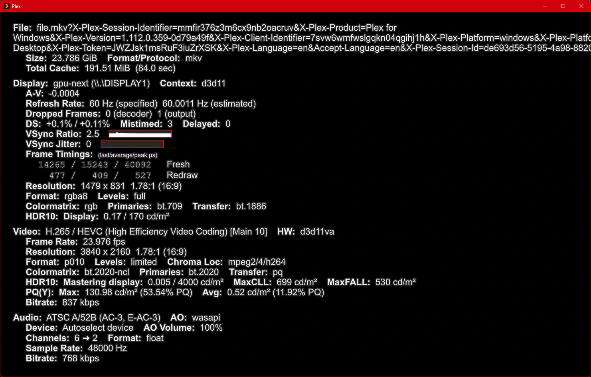
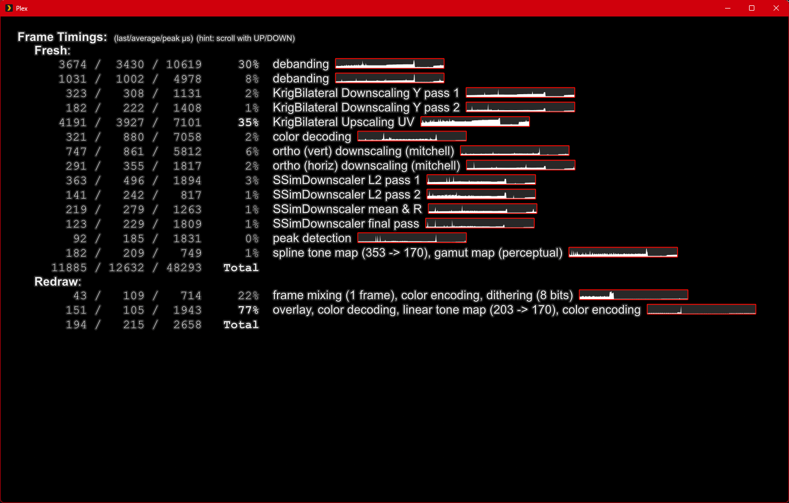
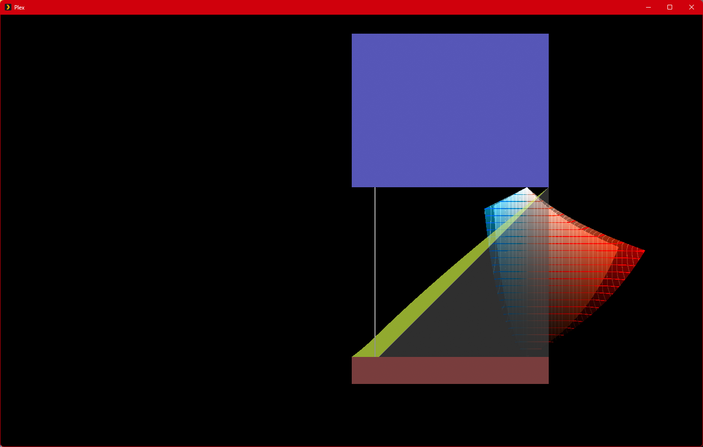

# Plex-HDR-Fix: PLEX HDR Fix
### 🚀 Precision Color Management: Take Control Back from Windows

By default, **Plex Desktop performs no internal tone mapping.** It relies entirely on the OS (Windows/macOS) or your monitor's hardware to handle the signal. This "passive" approach often fails:
- **On SDR Screens**: You get a washed-out, grey image because the OS can't map HDR colors properly.
- **On HDR Screens**: It relies on generic system handling, often resulting in inaccurate brightness peaks, crushed highlights, or loss of fine detail.

This configuration suite fixes Plex by implementing an **active mpv pipeline** using the modern **`gpu-next`** renderer.

---

## 🌟 Why use this config?

1. **Active Control**: Stop relying on Windows' mediocre conversion. This config performs high-quality mapping internally for superior color accuracy.
2. **Bit-Perfect HDR**: Match mpv's output peak **exactly** to your calibrated profile to prevent quality-degrading secondary conversions by the OS.
3. **Advanced SDR-to-HDR**: Uses **Inverse Tone Mapping** to make standard SDR content look vibrant and dynamic on HDR displays.
4. **Optimized HDR-to-SDR**: Fine-tuned profiles for various algorithms (Spline, BT.2446a, etc.) ensure HDR movies look perfect on standard monitors.
5. **No Extra Downloads**: Leverages high-end shaders already included in the Plex package (SSim/Krig) to eliminate blur.

---

## 🛠️ Installation & Configuration

### 1. Locate your Plex mpv directory
- **Windows**: `%LOCALAPPDATA%\Plex\`
- **macOS**: `~/Library/Application Support/Plex/`

### 2. Copy Config Files
Place the `mpv.conf` and `input.conf` from this repository into the root of the Plex directory identified above.

### 3. Setup Your Output Mode (SDR vs HDR)
The config must know if your monitor is currently in SDR or HDR mode. Open `mpv.conf` and edit the following line:

*   **For SDR Output (Default)**:
    `target-colorspace-hint=no`
*   **For HDR Output**:
    `target-colorspace-hint=yes` *(Note: Windows HDR must also be toggled "On" in System Settings).*

> **Tip**: You can also toggle this instantly during playback by pressing **`Shift + T`**.

For SDR Monitor, the installation process is bascially done except you need different Target Peak from default (170).
For HDR Monitor, pls go ahead to next step to configure the proper Target Peak (if other than default of 400).

### 4. Calibrate Your Target Peak (The Secret to Contrast)
To prevent Windows from interfering with the image, you must align the `target-peak` in `mpv.conf`:

*   **For SDR Output (HDR-to-SDR)**:
    - Locate the **`[HDR-SDR-Default]`** section.
    - Default is set to **`target-peak=170`**. 
    - **Why?** Standard 203 nits can look dull; **170** provides a much **punchier image with deeper contrast** on standard SDR displays.

*   **For HDR Output (Native HDR & SDR-to-HDR Upscaling)**:
    - Locate **BOTH** the **`[HDR-HDR-Default]`** and **`[SDR-HDR-Default]`** sections.
    - Set `target-peak` in both sections to **exactly match** your Windows HDR Calibration value (e.g., 400, 600, or 1000).
    - **Why?** This ensures both native HDR and upscaled SDR (Inverse Tone Mapping) align perfectly with your monitor's hardware, preventing Windows from double-processing the signal.
    - ⚠️ **CRITICAL**: **DO NOT set this to `auto`.** If set to auto, mpv will skip the internal tone mapping engine and passthrough the signal to the OS, which defeats the purpose of this custom configuration and calibration.
---

## 📊 Real-time Monitoring (Dashboard)
*   Pressing `d` triggers the MPV dashboard, allowing you to monitor video information, peak brightness, and renderer status & processing time.
*   Pressing 'g' triggers tone mapping graph.

### Dashboard - Main Page

### Dashboard - 2nd Page

### Tone Mappping Graph

---

## ⌨️ Hotkeys (Full Key Operations)

| Function | Increase (**Shift**) | Decrease (**Alt**) | Reset (**Alt + Shift**) | Info |
| :--- | :--- | :--- | :--- | :--- |
| **Tone Mapping** | `M` | `Alt + m` | `Alt + M` (Reset to Auto) | `m` |
| **Target Peak** | `P` | `Alt + p` | `Alt + P` (Reset to Auto) | `p` |
| **TM Parameter** | `N` | `Alt + n` | `Alt + N` (Reset to Default) | `n` |
| **Saturation** | `S` | `Alt + s` | `Alt + S` (Reset to 0) | `s` |
| **Compute Peak** | `C` | `Alt + c` | `Alt + C` (Reset to Auto) | `c` |
| **Output Mode** | `T` (SDR/HDR) | - | `Alt + T` (Force SDR) | `t` |
| **Rendering Mode**| `R` (Custom/MPV) | - | - | `r` |
| **Interpolation** | `I` (On/Off) | - | - | `i` |
| **Panscan & Zoom** | `H` (Off/Panscan) | `Alt + h` (Off/Zoom) | `Alt + H` (Reset to Off) | `h` |
| **Filter (Cropping)** | `F` (Off/16:9/0.8x/W=1.9xH) | - | `Alt + F` (Reset to Off) | `f` |
| **Unscale Mode** | `W` (Off/On/downscale-big) | - | - | `w` |
| **Video Params** | - | - | - | `v` |
| **Tone Mapping Graph** | - | - | - | `g` |
| **System Info** | - | - | - | `d` |

---

## 💡 Troubleshooting
*   **Performance**: If the video stutters, your GPU might be struggling with `gpu-next`. Try commenting out the `glsl-shaders` lines in `mpv.conf`.
*   **HDR Output**: If colors look wrong, ensure your monitor is actually in HDR mode in Windows settings before toggling **`Shift + T`**.

---

## ⚠️ Disclaimer & Community Feedback
- **Tested Environment**: This configuration has been primarily developed and tested on **Windows 11** with SDR displays.
- **Mac Users**: While the paths are provided (`~/Library/Application Support/Plex/`), the behavior of `vo=gpu-next` on macOS (Metal API) may vary. 
- **HDR Monitors**: Since I am using an SDR display, the HDR-to-HDR profiles rely on standard MPV math and user-reported nit values.

**Have a Mac or HDR screen?** If you test this config, please share your results in the **Issues** tab! Your feedback helps make this config better for everyone.
